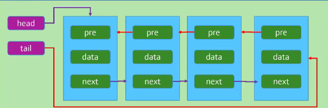

<!--
 * @Author: Holin Wang
 * @Date: 2022-03-04 16:41:48
 * @LastEditors: Holin Wang
 * @LastEditTime: 2022-03-15 21:27:16
 * @Description: 双向链表的实现及应用
-->
# algorithm-learning
算法学习，永无止境，本仓库主要记录自己学习算法的一些笔记。内容主要参考《学习JavaScript数据结构与算法》第三版
# 基本的数据结构 - 双向链表

## 双向链表的概念特点
> 1. 既可以从头遍历到尾，又可以从尾遍历到头；
> 2. 链表相连的过程是双向的（每个节点既指向下一个引用，同时指向前一个引用）；
> 3. 一个节点既有向前连接的引用，也有一个向后连接的引用；
> 4. 可以使用一个head和一个tail分别指向头部和尾部的节点；
> 5. 每个节点由三部分组成： 前一个节点的指针`prev`;保存的元素`item`;后一个节点的指针`next`；
> 6. 双向链表的第一个节点的prev为null；
> 7. 双向链表的最后的节点的next为null。
##  双向链表常用的方法
> 1. append(element): 添加新元素到链表尾部
> 2. insert(position,element): 向列表的特定位置插入一个新的项
> 3. get(position): 获取对应位置的元素
> 4. indexOf(element): 返回元素在列表中的索引，如果没有则返回-1
> 5. update(position): 修改某个位置的元素
> 6. removeAt(position): 从列表的特定位置移除一项
> 7. remove(element): 从列表中移除一项
> 8. isEmpty(): 判空，链表为空返回true,反之false
> 9. size(): 返回链表的大小
> 10. toString(): toString方法
> 11. forwardString(): 返回正向遍历的节点字符串形式
> 12. backswordString():返回反向遍历的节点的字符串形式


##  双向链表的实现
```javascript
/*
 * @Author: Holin Wang
 * @Date: 2022-03-16 21:10:45
 * @LastEditors: Holin Wang
 * @LastEditTime: 2022-03-16 21:11:48
 * @Description: 双向链表的实现
 */
function DoublyLinkedList() {
  // 内部类
  function Node(data) {
    this.data = data;
    this.prev = null;
    this.next = null;
  }
  // 属性
  this.head = null;
  this.tail = null;
  this.length = 0;


  // 定义相关的操作方法
  // 1. append方法
  DoublyLinkedList.prototype.append = function (element) {
    // 1. 根据元素创建节点
    let newNode = new Node(element);
    // 2. 判断列表是否为空
    if (this.head === null) {
      this.head = newNode;
      this.tail = newNode;
    } else {
      this.tail.next = newNode;
      newNode.prev = this.tail;
      this.tail = newNode;
    }
    // 3. length +1
    this.length += 1;
  }
  // 2. 将字符串转换为字符串形式
  // 2.1 toString方法
  DoublyLinkedList.prototype.toString = function () {
    return this.backswordString();
  }

  // 2.2 forwardString方法
  DoublyLinkedList.prototype.forwardString = function () {
    // 1. 定义变量
    let current = this.tail;
    let resString = "";

    // 2. 循环遍历
    while (current) {
      resString += current.data + " ";
      current = current.prev;
    }
    return resString;
  }

  // 2.3 backswordString方法
  DoublyLinkedList.prototype.backswordString = function () {
    // 1. 定义变量
    let current = this.head;
    let resString = "";

    // 2. 循环遍历
    while (current) {
      resString += current.data + " ";
      current = current.next;
    }
    return resString;
  }

  // 3. insert方法
  DoublyLinkedList.prototype.insert = function (position, element) {
    // 1.判断越界的问题
    if (position < 0 || position > this.length) {
      return false;
    }
    // 2. 创建新的节点
    let newNode = new Node(element);
    // 3. 判断插入位置
    if (position === 0) {                     // 插入首位
      // 链表为空
      if (this.head == null) {
        this.head = newNode;
        this.tail = newNode;
      } else {
        this.head.prev = newNode;
        newNode.next = this.head;
        this.head = newNode;
      }
    } else if (position === this.length) {    // 插入尾部
      this.tail.next = newNode;
      newNode.prev = this.tail;
      this.tail = newNode;
    } else {                                // 插入中间
      // 定义属性
      let current = this.head;
      let index = 0;
      while (index++ < position) {
        current = current.next;
      }
      newNode.next = current;
      newNode.prev = current.prev;
      current.prev.next = newNode;
      current.prev = newNode;
    }
    // 4. length + 1
    this.length += 1;
  }

  // 4. get 获取对应位置的元素
  DoublyLinkedList.prototype.get = function (position) {
    // 1.判断越界的问题
    if (position < 0 || position >= this.length) {
      return false;
    }
    let index = 0;
    let current = this.head;
    // 提高查询效率
    if ((this.length / 2) > position) {
      while (index++ < position) {
        current = current.next;
      }
    } else {
      current = this.tail;
      index = this.length - 1;
      while (index-- > position) {
        current = current.prev;
      }
    }
    return current.data;
  }

  // 5. get 获取对应位置的元素
  DoublyLinkedList.prototype.indexOf = function (data) {
    let current = this.head;
    let index = 0;
    while (current) {
      if (current.data === data) {
        return index;
      }
      current = current.next;
      index += 1;
    }
    return -1;
  }

  // 6. update 获取对应位置的元素
  DoublyLinkedList.prototype.update = function (position, newData) {
    // 1.判断越界的问题
    if (position < 0 || position >= this.length) {
      return false;
    }
    let index = 0;
    let current = this.head;
    // 提高查询效率
    if ((this.length / 2) > position) {
      while (index++ < position) {
        current = current.next;
      }
    } else {
      current = this.tail;
      index = this.length - 1;
      while (index-- > position) {
        current = current.prev;
      }
    }
    current.data = newData;
  }

  // 7. removeAt 获取对应位置的元素
  DoublyLinkedList.prototype.removeAt = function (position) {
    // 1.判断越界的问题
    if (position < 0 || position > this.length) {
      return false;
    }
  }
}

let doublyLinkedList = new DoublyLinkedList();
// append test
doublyLinkedList.append("aaa");
doublyLinkedList.append("bbb");
doublyLinkedList.append("ccc");

doublyLinkedList.insert(0, 'a');
doublyLinkedList.insert(2, 'b');
doublyLinkedList.insert(4, 'd');

doublyLinkedList.update(1, "h")

console.log(doublyLinkedList.toString());
console.log(doublyLinkedList.get(3));
console.log(doublyLinkedList.toString());
console.log(doublyLinkedList.indexOf("a"));
// console.log(doublyLinkedList.forwardString());

// console.log(doublyLinkedList.backswordString());
```