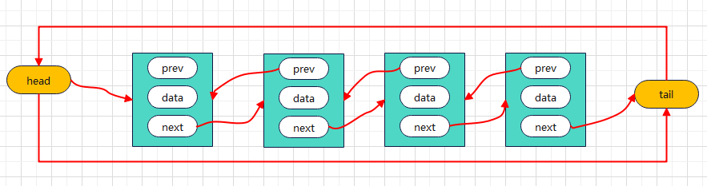

<!--
 * @Author: Holin Wang
 * @Date: 2022-03-04 16:41:48
 * @LastEditors: Holin Wang
 * @LastEditTime: 2022-03-12 15:05:59
 * @Description: 双向循环链表的实现及应用
-->
# algorithm-learning
算法学习，永无止境，本仓库主要记录自己学习算法的一些笔记。内容主要参考《学习JavaScript数据结构与算法》第三版
# 基本的数据结构 - 双向循环链表

## 链表的概念特点
> 和普同链表特点基本一致，不同点在于最后一个元素的next指向第一个元素head
## 双向循环链表常用的方法
> 1. enQueue(element): 添加新元素到队列尾部
> 2. deQueue(): 删除队列的第一项元素，并将其返回
> 3. peek(): 只查看队列的第一项元素
> 4. isEmpty(): 判空，队列为空返回true,反之false
> 5. clear(): 清空队列
> 6. size(): 返回队列的大小
> 7. toString(): toString方法
## 双向循环链表的实现
> 这里只实现append,insert 和 remove方法，其他方法和普通的链表实现方法
```javascript


function DoublyLoopLinkedList() {
  // 内部类
  function Node(data) {
    this.data = data;
    this.prev = null;
    this.next = null;
  }
  // 属性
  this.head = null;
  this.tail = null;
  this.length = 0;


  //1. append方法
  DoublyLoopLinkedList.prototype.append = function (element) {
    // 1. 创建节点
    let newNode = new Node(element);
    // 2. 判断是否尾空
    if (this.head === null) {
      this.head = newNode;
      this.tail = newNode;
      this.head.prev = this.tail;
      this.tail.next = this.head;
    } else {
      let current = this.head;
      while (current.next !== this.head) {
        current = current.next;
      }
      current.next = newNode;
      newNode.prev = current;
      newNode.next = this.head;
    }

    this.length += 1;
  }

  // 2. insert方法 考虑三个位置 头、尾以及中间
  DoublyLoopLinkedList.prototype.insert = function (position, element) {
    // 1.判断越界的问题
    if (position < 0 || position > this.length) {
      return false;
    }
    if (position === 0) {                               //向头部添加
      if (this.head === null) {
        this.head = newNode;
        this.tail = newNode;
        newNode.next = this.tail;
        newNode.prev = this.head;
      } else {
        newNode.next = this.head;
        this.head.prev = newNode;
        this.head = newNode;
        newNode.prev = this.tail;
      }
    } else if (position === this.length) {               //向尾部添加
      let current = this.tail;
      current.next = newNode;
      newNode.prev = current;
      this.tail = newNode;
      newNode.next = this.head;
    } else {                                             //向中间添加
      let current = this.head;
      let index = 0;
      let previous = null;
      while (index++ < position) {
        previous.next = newNode;
        newNode.prev = previous;
        newNode.next = current;
        current.prev = newNode;
      }
    }
    this.length += 1;
  }
}


const doublyLoopLinkedList = new DoublyLoopLinkedList();
doublyLoopLinkedList.append("a");
doublyLoopLinkedList.append("b");
doublyLoopLinkedList.append("c");
console.log(doublyLoopLinkedList);
```