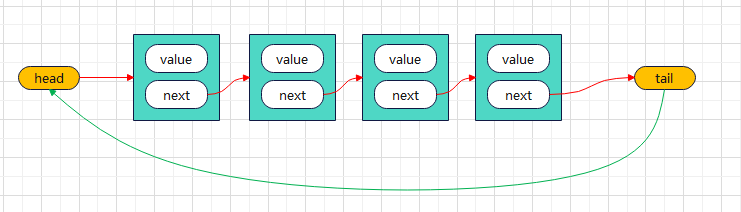

<!--
 * @Author: Holin Wang
 * @Date: 2022-03-04 16:41:48
 * @LastEditors: Holin Wang
 * @LastEditTime: 2022-03-12 15:05:59
 * @Description: 链表的实现及应用
-->
# algorithm-learning
算法学习，永无止境，本仓库主要记录自己学习算法的一些笔记。内容主要参考《学习JavaScript数据结构与算法》第三版
# 基本的数据结构 - 循环链表

## 链表的概念特点
> 同普链表特点基本一致，不同点在于最后一个元素的next指向第一个元素head
## 循环链表常用的方法
> 1. enQueue(element): 添加新元素到队列尾部
> 2. deQueue(): 删除队列的第一项元素，并将其返回
> 3. peek(): 只查看队列的第一项元素
> 4. isEmpty(): 判空，队列为空返回true,反之false
> 5. clear(): 清空队列
> 6. size(): 返回队列的大小
> 7. toString(): toString方法
## 循环链表的实现
> 这里只实现insert 和 remove方法，其他方法和普通的链表实现方法
```javascript
/*
 * @Author: Holin Wang
 * @Date: 2022-03-08 08:47:30
 * @LastEditors: Holin Wang
 * @LastEditTime: 2022-03-10 22:29:11
 * @Description: 单向链表的封装
 */
function LinkedList() {
  // 内部节点类
  function Node(data) {
    this.data = data;
    this.next = null;
  }
  // 属性
  this.head = null; //链表的第一个节点
  this.length = 0; //用来记录链表的长度

  // 1. 追加方法
  LinkedList.prototype.append = function (data) {
    // 1. 创建新节点
    const nweNode = new Node(data);
    // 2. 判断是否是第一个节点
    if (this.length === 0) {
      this.head = nweNode;
    } else {
      // 找到最后一个节点（链表的特点无法跳过第一个节点寻找下一个节点）
      let current = this.head; // 获取第一个节点
      // 循环链表找到最后一个节点的位置
      while (current.next) {
        current = current.next;
      }
      current.next = nweNode;
    }
    // 3. length+1
    this.length += 1;
  };
  // 2. toString方法
  LinkedList.prototype.toString = function () {
    // 1. 定义变量
    let current = this.head;
    let listStr = "";
    // 2. 循环每个节点
    while (current) {
      listStr += current.data + " ";
      current = current.next;
    }
    return listStr;
  };

  // 3. 向链表指定位置添加元素
  LinkedList.prototype.insert = function (position, data) {
    // 1. 越界判断
    if (position < 0 || position > this.length) {
      return false;
    }
    // 2. 根据data创建node
    const newData = new Node(data);
    if (position === 0) {
      newData.next = this.head; // 相当于newData.next = null;
      this.head = newData;
    } else {
      let index = 0;
      let current = this.head;
      let previous = null;
      while (index++ < position) {
        previous = current;
        current = current.next;
      }
      previous.next = newData;
      newData.next = current;
    }
    // 4. length+1
    this.length += 1;
    return true;
  };

  // 4. 获取指定位置的元素
  LinkedList.prototype.get = function (position) {
    // 1. 越界判断
    if (position < 0 || position > this.length) {
      return false;
    }
    // 2. 获取对应的信息
    let current = this.head;
    let index = 0;
    while (index++ < position) {
      current = current.next;
    }
    return current.data;
  };

  // 5. 返回元素在链表中的索引，不存在返回-1
  LinkedList.prototype.indexOf = function(data){
    //1. 定义变量
    let current = this.head;
    let index = 0;
    // 2. 开始查找
    while(current){
        if(current.data === data){
            return index;
        }
        current = current.next;
        index += 1;
    }
    // 3. 没有找到
    return -1;
  }

    // 6. 修改指定位置的元素
  LinkedList.prototype.update = function (position, newData) {
    // 1. 越界判断
    if (position < 0 || position >= this.length) {
      return false;
    }
    // 2.查找正确的位置
    let current = this.head;
    let index = 0;
    while (index++ < position) {
      current = current.next;
    }
    current.data = newData;
    return true;
  };
  // 7. 删除指定的位置的元素
  LinkedList.prototype.removeAt = function (position) {
    // 1. 越界判断
    if (position < 0 || position >= this.length) {
      return false;
    }
    // 2. 判斷刪除的是否是第一个
    let current = this.head;
    if (position === 0) {
      this.head = null;
    } else {
      let index = 0;
      let previous = null;
      while (index++ < position) {
        previous = current;
        current = current.next;
      }
      previous.next = current.next;
    }
    //3. length - 1
    this.length -= 1;
    return current.data;
  };
  // 8. remove方法
  LinkedList.prototype.remove = function (data) {
    // 1. 获取data在链表中的位置
    let position = this.indexOf(data);
    // 2. 根据位置删除节点
    return this.removeAt(position);
  };
  // 9. isEmpty方法
  LinkedList.prototype.isEmpty = function () {
    return this.length === 0;
  };
  // 10. size方法
  LinkedList.prototype.size = function () {
    return this.length;
  };
}
```