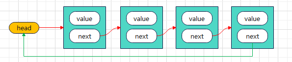

<!--
 * @Author: Holin Wang
 * @Date: 2022-03-04 16:41:48
 * @LastEditors: Holin Wang
 * @LastEditTime: 2022-03-12 15:05:59
 * @Description: 链表的实现及应用
-->
# algorithm-learning
算法学习，永无止境，本仓库主要记录自己学习算法的一些笔记。内容主要参考《学习JavaScript数据结构与算法》第三版
# 基本的数据结构 - 循环链表

## 链表的概念特点
> 同普链表特点基本一致，不同点在于最后一个元素的next指向第一个元素head
## 循环链表常用的方法
> 1. enQueue(element): 添加新元素到队列尾部
> 2. deQueue(): 删除队列的第一项元素，并将其返回
> 3. peek(): 只查看队列的第一项元素
> 4. isEmpty(): 判空，队列为空返回true,反之false
> 5. clear(): 清空队列
> 6. size(): 返回队列的大小
> 7. toString(): toString方法
## 循环链表的实现
> 这里只实现insert 和 remove方法，其他方法和普通的链表实现方法
```javascript
function LoopLinkedList() {
  // 内部节点类
  function Node(data) {
    this.data = data;
    this.next = null;
  }
  // 属性
  this.head = null;
  this.length = 0;

  // 1.append方法
  LoopLinkedList.prototype.append = function (data) {
    // 1. 创建新节点
    const newNode = new Node(data);
    let current = this.head;
    if (!this.head) {
      this.head = newNode;
      newNode.next = this.head;
    } else {
      // 找到最后一个节点
      while (current.next !== this.head) {
        current = current.next;
      }
      current.next = newNode;
      newNode.next = this.head;
    }

    this.length += 1;
    return true
  }

  // 2. insert方法
  LoopLinkedList.prototype.insert = function (position, data) {
    // 1. 越界判断
    if (position < 0 || position > this.length) {
      return false;
    }
    // 2. 创建新节点
    const newNode = new Node(data);
    if (this.length === 0) {
      this.head = newNode;
      newNode.next = this.head;
    } else {

    }


    if (position === 0) {

    }

    this.length += 1;
  }
}


const loopLinkedList = new LoopLinkedList();

loopLinkedList.append("aaa");
loopLinkedList.append("bbb");


console.log(loopLinkedList);
```